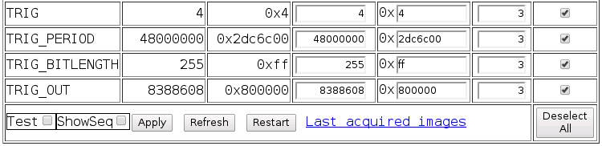

Triggering the Elphel Camera
============================

Details are on the [Elphel wiki page on triggering](http://wiki.elphel.com/index.php?title=Trigger), nonetheless here are some notes.

The TRIG_PERIOD is in 32 bit or 96 kHz, meaning that if you set the value to 96000000, this equals to one trigger pulse per second, 48000000 to two pulses per second, obviously.

To see something on the attached LED (or detect a pulse on an attached cable), you have to se the TRIG_OUT to 800000, and set the TRIG_BITLENGTH sufficiently hight, e.g above 128. If you set TRIG_BITLENGTH to low values, you barely see something on the LED, while setting it to 255 gives a satisfying blink on the LED.

You'll get the settings below (external trigger, one per second, with a blinking LED) if you click on the [link here](http://192.168.0.9/parsedit.php?embed=0.1&title=External+trigger+controls&TRIG=4&TRIG_PERIOD=96000000&&TRIG_BITLENGTH=255&TRIG_OUT=0x800000). This calls all necessary parameters. Set them with pressing "Apply".

